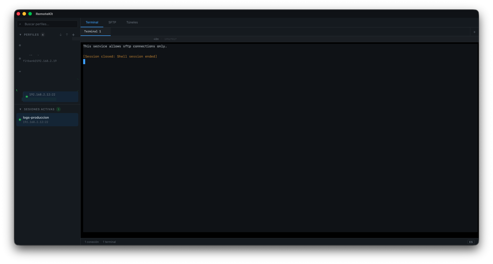
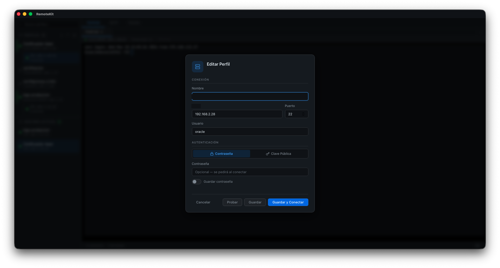
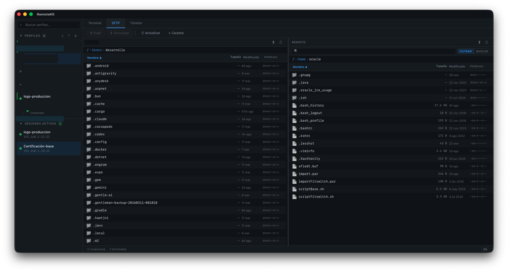
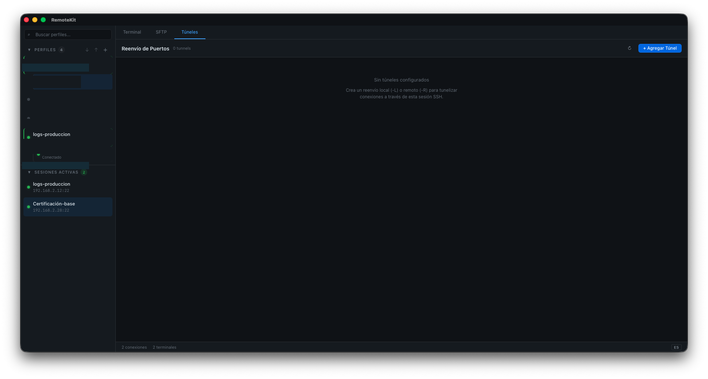

<div align="center">

# NexTerm

### A Modern Cross-Platform SSH Client

[](LICENSE)
[](https://github.com/cognidevai/nexterm/releases)
[](https://github.com/cognidevai/nexterm/releases)
[](https://github.com/cognidevai/nexterm/releases)
[](https://v2.tauri.app)
[](https://www.rust-lang.org)
[](https://react.dev)
[](https://www.typescriptlang.org)

**NexTerm** is a fast, secure, and feature-rich SSH client built with Tauri 2.0. It combines a native Rust backend with a modern React frontend to deliver terminal emulation, SFTP file management, SSH tunneling, and encrypted credential storage — all in a single, lightweight desktop application.

</div>

---

## Screenshots

<div align="center">

|  |  |
|:---:|:---:|
|  |  |
| **Terminal Emulator** | **Connection Profile Editor** |
|  |  |
| **SFTP File Browser** | **SSH Tunnels** |

</div>

---

## Features

### Terminal Emulator
- Full-featured terminal powered by **xterm.js 6** with GPU-accelerated rendering
- Multi-tab interface — open multiple terminals per session
- Customizable themes, fonts, and cursor styles
- Unicode and emoji support
- Search within terminal buffer

### SFTP File Browser
- Dual-pane layout: local filesystem on the left, remote on the right
- Drag-and-drop file upload and download
- Built-in file viewer for quick content inspection
- Remote file search across directories
- Batch operations: copy, move, rename, delete

### SSH Tunneling
- **Local forwarding** (`-L`): Access remote services through a local port
- **Remote forwarding** (`-R`): Expose local services to the remote network
- Live traffic statistics with bytes sent/received
- Create, pause, and manage multiple tunnels per session

### Encrypted Vault
- Credentials secured with **AES-256-GCM** symmetric encryption
- Master password derived using **Argon2id** (winner of the Password Hashing Competition)
- Passwords and private keys are **never stored in plain text**
- Vault is locked automatically after inactivity

### Connection Profiles
- Save and organize connection details for quick access
- Supported authentication methods:
  - Password
  - Public key (with optional passphrase)
  - Keyboard-interactive
- Group profiles by folders or tags

### Host Key Verification
- **Trust-on-first-use (TOFU)** model — like SSH `known_hosts`
- Alerts on host key changes to protect against MITM attacks
- View and manage trusted host fingerprints

### Internationalization
- English and Spanish interface
- Extensible i18n framework for additional languages

### Cross-Platform
- Native builds for **macOS** (Apple Silicon + Intel), **Linux**, and **Windows**
- Automated CI/CD via **GitHub Actions**
- Lightweight binaries thanks to Tauri's minimal runtime

---

## Installation

Download the latest release for your platform:

| Platform | Download |
|----------|----------|
| macOS (Apple Silicon) | [NexTerm_aarch64.dmg](https://github.com/cognidevai/nexterm/releases/latest) |
| macOS (Intel) | [NexTerm_x64.dmg](https://github.com/cognidevai/nexterm/releases/latest) |
| Linux (AppImage) | [NexTerm.AppImage](https://github.com/cognidevai/nexterm/releases/latest) |
| Linux (deb) | [NexTerm.deb](https://github.com/cognidevai/nexterm/releases/latest) |
| Windows | [NexTerm_Setup.exe](https://github.com/cognidevai/nexterm/releases/latest) |

> All binaries are unsigned for now. On macOS, you may need to right-click and select "Open" on first launch.

---

## Build from Source

### Prerequisites

| Tool | Version |
|------|---------|
| [Rust](https://www.rust-lang.org/tools/install) | Latest stable |
| [Node.js](https://nodejs.org) | 18+ |
| [pnpm](https://pnpm.io/installation) | 9+ |

You also need the [Tauri prerequisites](https://v2.tauri.app/start/prerequisites/) for your platform (system dependencies for webview, etc.).

### Steps

```bash
# Clone the repository
git clone https://github.com/cognidevai/nexterm.git
cd nexterm

# Install frontend dependencies
pnpm install

# Run in development mode (hot-reload)
pnpm tauri dev

# Build for production
pnpm tauri build
```

Production artifacts are output to `src-tauri/target/release/bundle/`.

---

## Tech Stack

| Layer | Technology | Purpose |
|-------|-----------|---------|
| Desktop Runtime | Tauri 2.0 | Native window, IPC, system APIs |
| Backend | Rust | SSH protocol, encryption, file I/O |
| SSH Protocol | russh | Async SSH2 implementation in Rust |
| Frontend | React 19 | UI components and views |
| Language | TypeScript 5.7 (strict) | Type-safe frontend development |
| Bundler | Vite 6 | Fast dev server and production builds |
| State Management | Zustand 5 | Lightweight, hook-based state |
| Terminal | xterm.js 6 | Terminal emulation in the browser |
| Encryption | AES-256-GCM + Argon2id | Credential vault |
| CI/CD | GitHub Actions | Automated builds and releases |

---

## Security

NexTerm takes credential security seriously. The **Encrypted Vault** architecture works as follows:

1. **Master Password** — On first launch, the user sets a master password. This password is never stored anywhere.
2. **Key Derivation** — The master password is processed through **Argon2id** with a unique random salt to produce a 256-bit encryption key. Argon2id is resistant to both GPU-based and side-channel attacks.
3. **Encryption** — All stored credentials (passwords, private keys, passphrases) are encrypted with **AES-256-GCM**, which provides both confidentiality and integrity verification.
4. **At Rest** — The vault file on disk contains only ciphertext and the Argon2id salt. Without the master password, the contents are computationally infeasible to recover.
5. **In Memory** — Decrypted credentials are held in memory only for the duration of an active session and are cleared on lock or exit.

> **Passwords and private keys are never written to disk in plain text.**

If you discover a security vulnerability, please report it privately via [GitHub Security Advisories](https://github.com/cognidevai/nexterm/security/advisories) rather than opening a public issue.

---

## Contributing

Contributions are welcome! Here's how to get started:

1. **Open an issue first** — Describe the bug or feature you'd like to work on
2. **Fork the repo** and create a feature branch (`git checkout -b feat/my-feature`)
3. **Make your changes** with clear commit messages
4. **Submit a pull request** referencing the issue

Please make sure your code passes existing tests and linting before submitting.

---

## License

This project is licensed under the **MIT License** — see the [LICENSE](LICENSE) file for details.

---

<div align="center">

Made by [cognidevai](https://github.com/cognidevai)

</div>

---
---

<div align="center">

## Español

</div>

<div align="center">

# NexTerm

### Un Cliente SSH Moderno y Multiplataforma

**NexTerm** es un cliente SSH rápido, seguro y completo, construido con Tauri 2.0. Combina un backend nativo en Rust con un frontend moderno en React para ofrecer emulación de terminal, gestión de archivos por SFTP, túneles SSH y almacenamiento cifrado de credenciales — todo en una única aplicación de escritorio liviana.

</div>

---

### Capturas de Pantalla

<div align="center">

|  |  |
|:---:|:---:|
|  |  |
| **Emulador de Terminal** | **Editor de Perfiles de Conexión** |
|  |  |
| **Explorador de Archivos SFTP** | **Túneles SSH** |

</div>

---

### Características

#### Emulador de Terminal
- Terminal completo impulsado por **xterm.js 6** con renderizado acelerado por GPU
- Interfaz multi-pestaña — múltiples terminales por sesión
- Temas, fuentes y estilos de cursor personalizables
- Soporte para Unicode y emojis
- Búsqueda dentro del buffer del terminal

#### Explorador de Archivos SFTP
- Diseño de doble panel: sistema de archivos local a la izquierda, remoto a la derecha
- Subida y descarga de archivos con arrastrar y soltar
- Visor de archivos integrado para inspección rápida de contenido
- Búsqueda remota de archivos entre directorios
- Operaciones por lotes: copiar, mover, renombrar, eliminar

#### Túneles SSH
- **Reenvío local** (`-L`): Accedé a servicios remotos a través de un puerto local
- **Reenvío remoto** (`-R`): Exponé servicios locales a la red remota
- Estadísticas de tráfico en vivo con bytes enviados/recibidos
- Creá, pausá y administrá múltiples túneles por sesión

#### Bóveda Cifrada
- Credenciales protegidas con cifrado simétrico **AES-256-GCM**
- Contraseña maestra derivada con **Argon2id** (ganador del Password Hashing Competition)
- Las contraseñas y claves privadas **nunca se almacenan en texto plano**
- La bóveda se bloquea automáticamente tras inactividad

#### Perfiles de Conexión
- Guardá y organizá los datos de conexión para acceso rápido
- Métodos de autenticación soportados:
  - Contraseña
  - Clave pública (con frase de paso opcional)
  - Interactivo por teclado (keyboard-interactive)
- Agrupá perfiles por carpetas o etiquetas

#### Verificación de Clave de Host
- Modelo **Trust-on-first-use (TOFU)** — como `known_hosts` de SSH
- Alertas ante cambios en la clave del host para proteger contra ataques MITM
- Visualización y gestión de huellas digitales de hosts confiables

#### Internacionalización
- Interfaz en inglés y español
- Framework de i18n extensible para idiomas adicionales

#### Multiplataforma
- Binarios nativos para **macOS** (Apple Silicon + Intel), **Linux** y **Windows**
- CI/CD automatizado con **GitHub Actions**
- Binarios livianos gracias al runtime mínimo de Tauri

---

### Instalación

Descargá la última versión para tu plataforma:

| Plataforma | Descarga |
|------------|----------|
| macOS (Apple Silicon) | [NexTerm_aarch64.dmg](https://github.com/cognidevai/nexterm/releases/latest) |
| macOS (Intel) | [NexTerm_x64.dmg](https://github.com/cognidevai/nexterm/releases/latest) |
| Linux (AppImage) | [NexTerm.AppImage](https://github.com/cognidevai/nexterm/releases/latest) |
| Linux (deb) | [NexTerm.deb](https://github.com/cognidevai/nexterm/releases/latest) |
| Windows | [NexTerm_Setup.exe](https://github.com/cognidevai/nexterm/releases/latest) |

> Los binarios no están firmados por el momento. En macOS, puede que necesites hacer clic derecho y seleccionar "Abrir" en el primer inicio.

---

### Compilar desde el Código Fuente

#### Requisitos Previos

| Herramienta | Versión |
|-------------|---------|
| [Rust](https://www.rust-lang.org/tools/install) | Última estable |
| [Node.js](https://nodejs.org) | 18+ |
| [pnpm](https://pnpm.io/installation) | 9+ |

También necesitás los [prerequisitos de Tauri](https://v2.tauri.app/start/prerequisites/) para tu plataforma (dependencias del sistema para webview, etc.).

#### Pasos

```bash
# Clonar el repositorio
git clone https://github.com/cognidevai/nexterm.git
cd nexterm

# Instalar dependencias del frontend
pnpm install

# Ejecutar en modo desarrollo (hot-reload)
pnpm tauri dev

# Compilar para producción
pnpm tauri build
```

Los artefactos de producción se generan en `src-tauri/target/release/bundle/`.

---

### Stack Tecnológico

| Capa | Tecnología | Propósito |
|------|-----------|-----------|
| Runtime de Escritorio | Tauri 2.0 | Ventana nativa, IPC, APIs del sistema |
| Backend | Rust | Protocolo SSH, cifrado, E/S de archivos |
| Protocolo SSH | russh | Implementación SSH2 asíncrona en Rust |
| Frontend | React 19 | Componentes y vistas de UI |
| Lenguaje | TypeScript 5.7 (estricto) | Desarrollo frontend con tipos seguros |
| Bundler | Vite 6 | Servidor de desarrollo rápido y builds de producción |
| Estado | Zustand 5 | Gestión de estado liviana basada en hooks |
| Terminal | xterm.js 6 | Emulación de terminal en el navegador |
| Cifrado | AES-256-GCM + Argon2id | Bóveda de credenciales |
| CI/CD | GitHub Actions | Builds y releases automatizados |

---

### Seguridad

NexTerm se toma en serio la seguridad de las credenciales. La arquitectura de la **Bóveda Cifrada** funciona así:

1. **Contraseña Maestra** — En el primer inicio, el usuario establece una contraseña maestra. Esta contraseña nunca se almacena en ningún lugar.
2. **Derivación de Clave** — La contraseña maestra se procesa a través de **Argon2id** con un salt aleatorio único para producir una clave de cifrado de 256 bits. Argon2id es resistente tanto a ataques basados en GPU como a ataques de canal lateral.
3. **Cifrado** — Todas las credenciales almacenadas (contraseñas, claves privadas, frases de paso) se cifran con **AES-256-GCM**, que proporciona tanto confidencialidad como verificación de integridad.
4. **En Reposo** — El archivo de la bóveda en disco contiene solo texto cifrado y el salt de Argon2id. Sin la contraseña maestra, recuperar el contenido es computacionalmente inviable.
5. **En Memoria** — Las credenciales descifradas se mantienen en memoria solo durante la sesión activa y se eliminan al bloquear o cerrar la aplicación.

> **Las contraseñas y claves privadas nunca se escriben en disco en texto plano.**

Si descubrís una vulnerabilidad de seguridad, por favor reportala de forma privada a través de [GitHub Security Advisories](https://github.com/cognidevai/nexterm/security/advisories) en lugar de abrir un issue público.

---

### Contribuir

Las contribuciones son bienvenidas. Así podés empezar:

1. **Abrí un issue primero** — Describí el bug o la funcionalidad que querés trabajar
2. **Hacé un fork del repo** y creá una rama de feature (`git checkout -b feat/mi-feature`)
3. **Hacé tus cambios** con mensajes de commit claros
4. **Enviá un pull request** referenciando el issue

Asegurate de que tu código pase los tests y el linting existentes antes de enviar.

---

### Licencia

Este proyecto está licenciado bajo la **Licencia MIT** — consultá el archivo [LICENSE](LICENSE) para más detalles.

---

<div align="center">

Hecho por [cognidevai](https://github.com/cognidevai)

</div>
